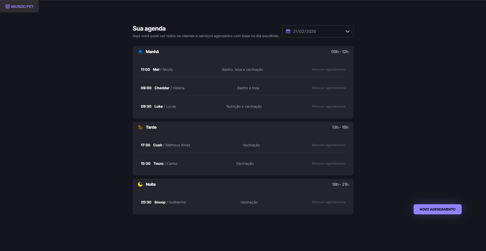
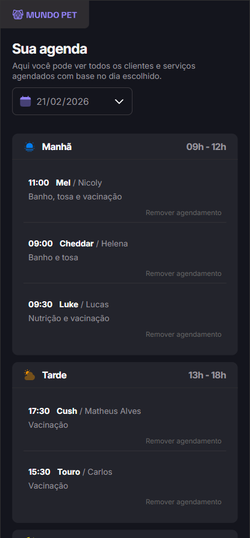

# 🐾 MundoPet

> Aplicação desenvolvida como desafio para praticar conhecimentos aprendidos sobre JavaScript Moderno

📂 **Repositório:** https://github.com/Matheus-AlvesCS/MundoPet

## 📖 Sobre o Projeto

Este projeto foi desenvolvido com o objetivo de praticar e demonstrar:

- Separação de códigos em módulos
- Compilação de código
- Empacotamento de código
- Uso de bibliotecas
- Estruturação de pastas
- Organização de código

## 🛠️ Stack Tecnológica

- JavaScript
- HTML
- CSS
- Git
- Webpack
- Json-server

## 📸 Demonstração

<p align="center">
  
  
</p>
<p align="center">
  <em>Versão Desktop e Versão Mobile</em>
</p>

## 🖥️ Como rodar o projeto

```bash
# Clone o repositório
git clone https://github.com/Matheus-AlvesCS/MundoPet.git

# Entre na pasta do projeto
cd MundoPet

# Instale as dependências
npm install

# Rode a api local
npm run server
! Atente-se que ao rodar a api ela irá travar o console e será necessário abrir outro e navegar novamente para a pasta do projeto

# Rode o projeto
npm run dev
```
